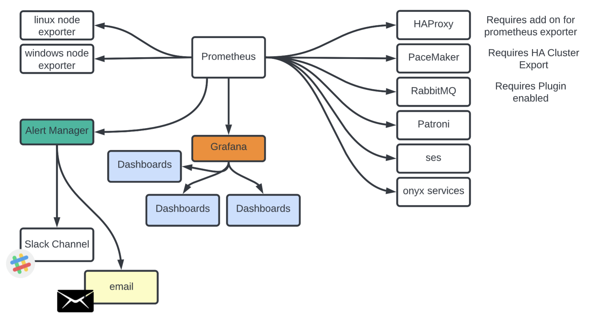

# System Monitoring - Prometheus, Grafana, Alert Manager

Repo for storing configurations and notes on how to set up system monitoring. 

This repo holds the following:
- docker files for install of grafana, prometheus, alert manager and cadvisor. 
- alert manager thresholds 
- understanding of the various endpoints that we are scraping

